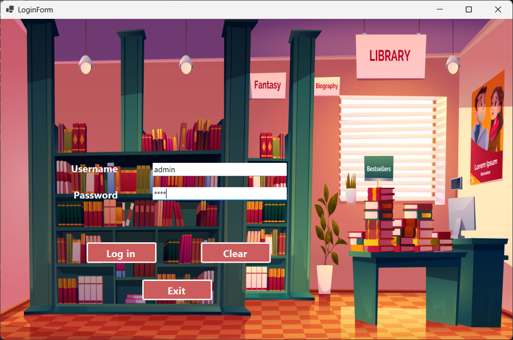
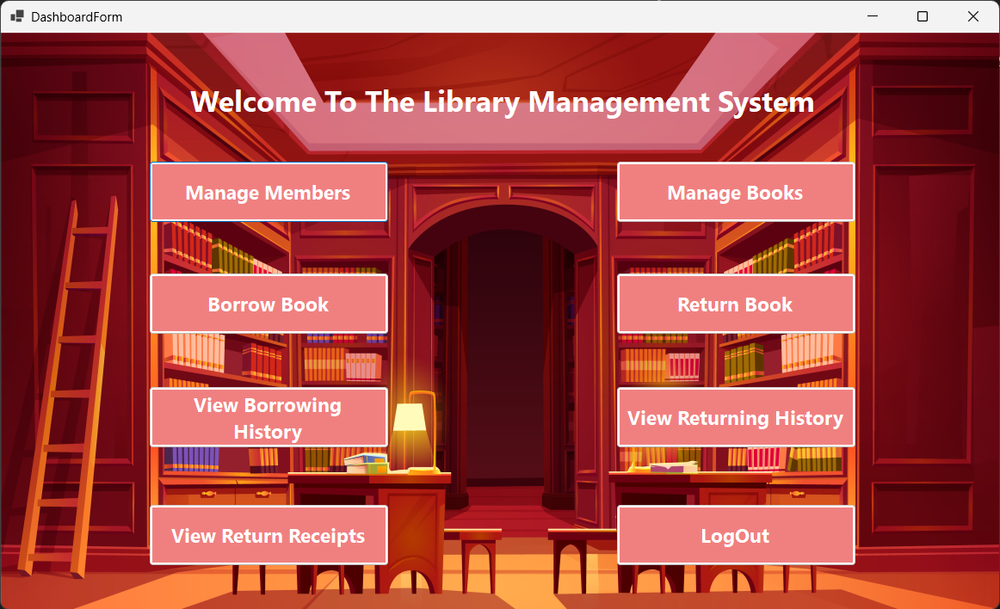
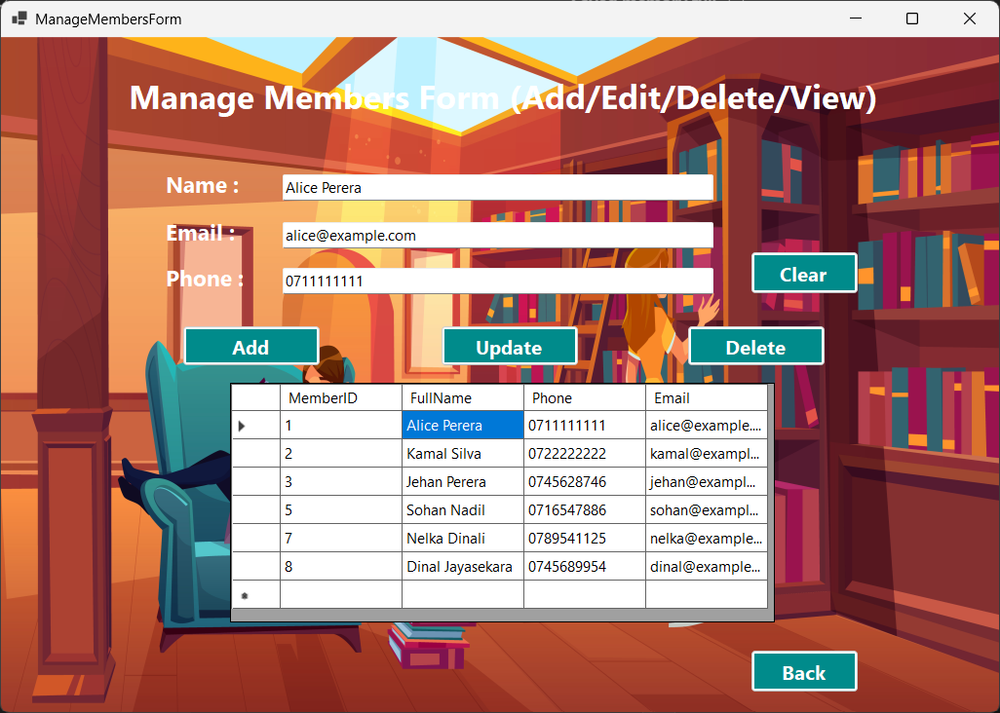
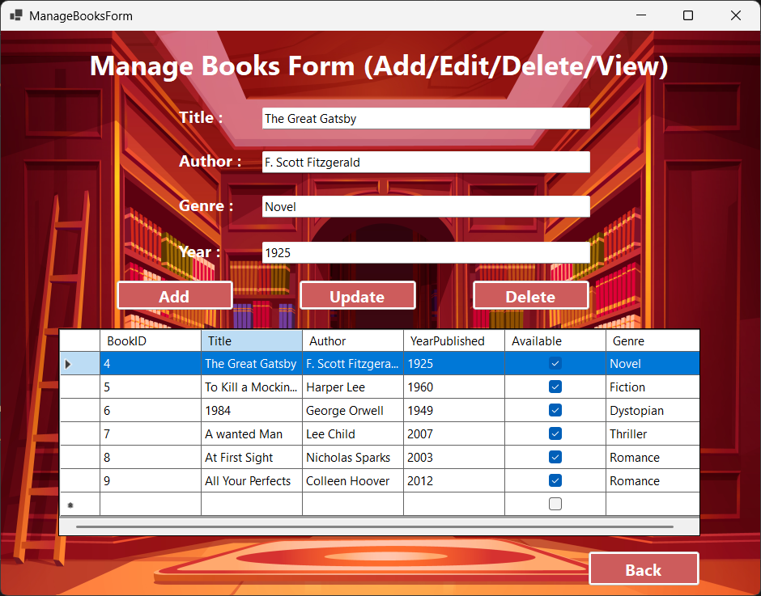
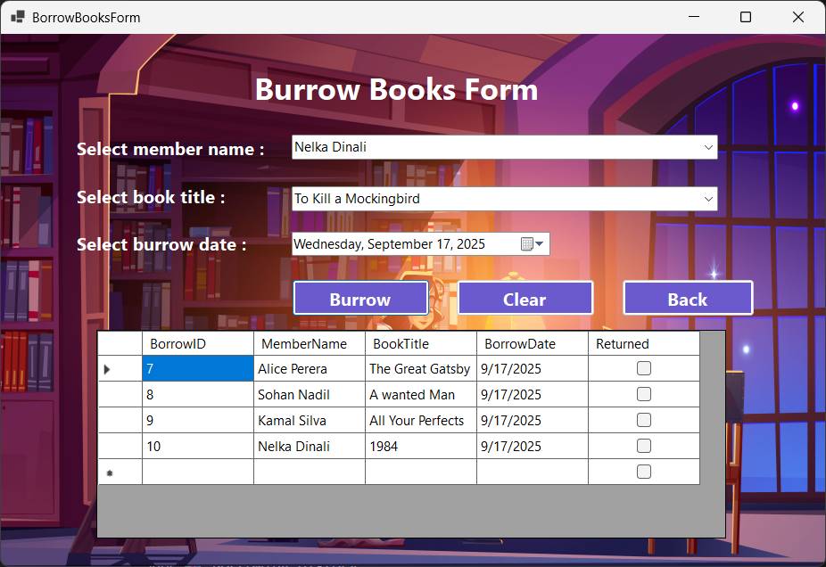
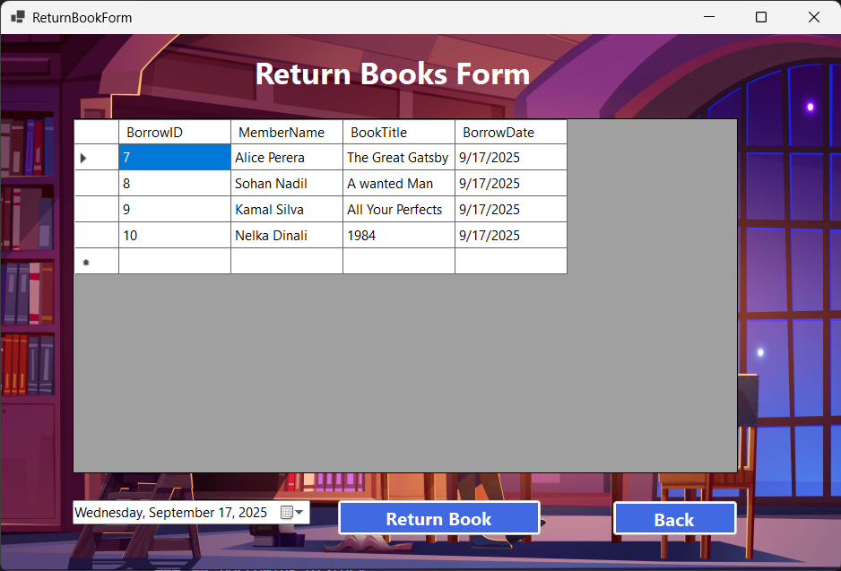
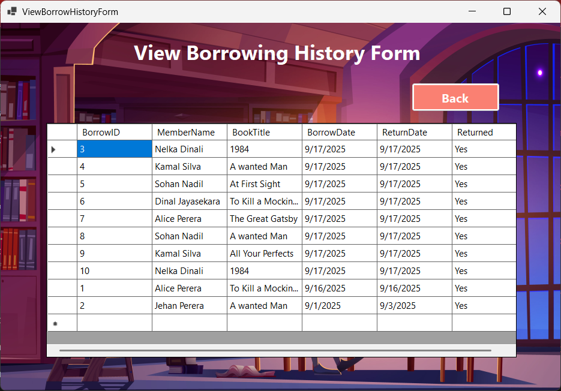
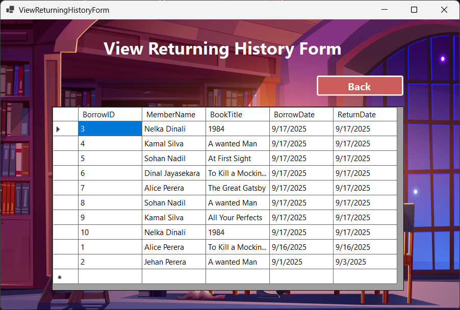
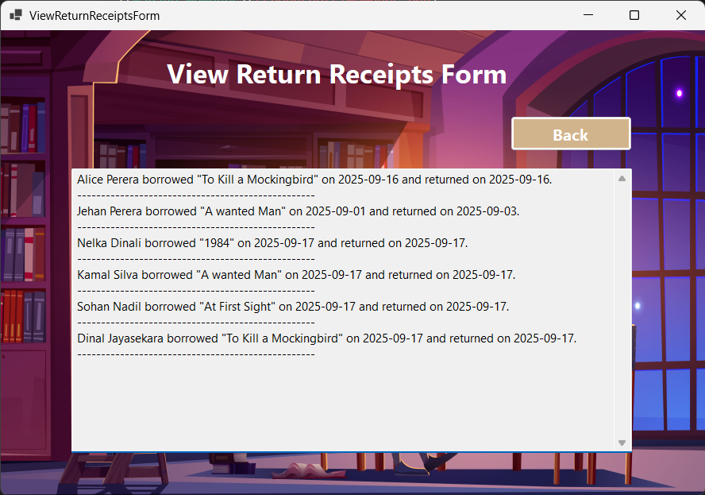

# 📚 Library Management System

A Windows Forms application built in **C# (.NET)** with **SQL Server (SSMS)** as the backend.  
This project is designed to manage books, members, borrowing, returning, and receipts in a library.

---

## 🔹 Features

### 🔑 Login System
- Validates user credentials from the **Users** table.
- Opens the **Dashboard** upon successful login.

### 🖥️ Dashboard
- Central navigation hub.
- Provides buttons to access Members, Books, Borrowing, Returning, History, Receipts, and Logout.

### 👥 Manage Members
- Add new members with details (name, email, phone).
- Update or delete existing members.
- View all members in a **DataGridView**.

### 📚 Manage Books
- Add new books with details (title, author, genre, year, quantity, availability).
- Update or delete existing books.
- View all books in a **DataGridView**.

### 📖 Borrow Books
- Select a member and a book from dropdown lists.
- Records borrowing details in the **BorrowHistory** table.
- Decreases available book quantity automatically.

### 📕 Return Books
- Marks a borrowed book as returned.
- Updates the return date in **BorrowHistory**.
- Increases book quantity.
- Generates a **receipt text file** for the return.

### 📊 Borrowing History
- Displays all borrow records (borrowed and returned).
- Shows whether a book is returned (**Yes/No**).

### 📈 Returning History
- Displays only returned books.
- Includes borrow and return dates.

### 📝 View Receipts
- Reads all generated receipts stored as `.txt` files.
- Displays them in a text box for easy viewing.

---

## 🛠️ Technologies Used
- **C# (.NET Windows Forms)**
- **Microsoft SQL Server (SSMS)**
- **ADO.NET (SqlConnection, SqlCommand, DataAdapter)**
- **File Handling** (for return receipts)

---

## 📂 Database Structure

### Users
| Column    | Type    |
|-----------|---------|
| UserID    | INT (PK) |
| Username  | NVARCHAR |
| Password  | NVARCHAR |
| Role      | NVARCHAR |

### Members
| Column    | Type    |
|-----------|---------|
| MemberID  | INT (PK) |
| FullName  | NVARCHAR |
| Email     | NVARCHAR |
| Phone     | NVARCHAR |

### Books
| Column        | Type    |
|---------------|---------|
| BookID        | INT (PK) |
| Title         | NVARCHAR |
| Author        | NVARCHAR |
| Genre         | NVARCHAR |
| YearPublished | INT |
| Quantity      | INT |
| Available     | BIT |

### BorrowHistory
| Column     | Type    |
|------------|---------|
| BorrowID   | INT (PK) |
| MemberID   | INT (FK) |
| BookID     | INT (FK) |
| BorrowDate | DATE |
| ReturnDate | DATE (NULL) |
| IsReturned | BIT |

---

## 🚀 How to Run
1. Clone the repository:
   ```bash
   git clone https://github.com/your-username/LibraryManagementSystem.git

*Open the solution in Visual Studio.

*Update the connectionString in each form to match your SQL Server instance.

*Run the SQL script to create the database (LibraryDB with Users, Members, Books, BorrowHistory tables).

-- Create Database
CREATE DATABASE LibraryDB;
GO

USE LibraryDB;
GO

-- Users Table
CREATE TABLE Users (
    UserID INT IDENTITY(1,1) PRIMARY KEY,
    Username NVARCHAR(50) NOT NULL,
    Password NVARCHAR(50) NOT NULL,
    Role NVARCHAR(20) NOT NULL
);

-- Insert Default Admin
INSERT INTO Users (Username, Password, Role) 
VALUES ('admin', '1234', 'Admin');

-- Members Table
CREATE TABLE Members (
    MemberID INT IDENTITY(1,1) PRIMARY KEY,
    FullName NVARCHAR(100) NOT NULL,
    Email NVARCHAR(100) NOT NULL,
    Phone NVARCHAR(20) NOT NULL
);

-- Books Table
CREATE TABLE Books (
    BookID INT IDENTITY(1,1) PRIMARY KEY,
    Title NVARCHAR(200) NOT NULL,
    Author NVARCHAR(100) NOT NULL,
    Genre NVARCHAR(50) NOT NULL,
    YearPublished INT NOT NULL,
    Quantity INT NOT NULL,
    Available BIT NOT NULL DEFAULT 1
);

-- Borrow History Table
CREATE TABLE BorrowHistory (
    BorrowID INT IDENTITY(1,1) PRIMARY KEY,
    MemberID INT NOT NULL,
    BookID INT NOT NULL,
    BorrowDate DATE NOT NULL,
    ReturnDate DATE NULL,
    IsReturned BIT NOT NULL DEFAULT 0,
    FOREIGN KEY (MemberID) REFERENCES Members(MemberID),
    FOREIGN KEY (BookID) REFERENCES Books(BookID)
);


*Press F5 in Visual Studio to run the app.

## 📸 Screenshots

### 🔑 Login Form


### 🖥️ Dashboard


### 👥 Manage Members


### 📚 Manage Books


### 📖 Borrow Books


### 📕 Return Books


### 📊 Borrowing History


### 📈 Returning History


### 📝 View Receipts

